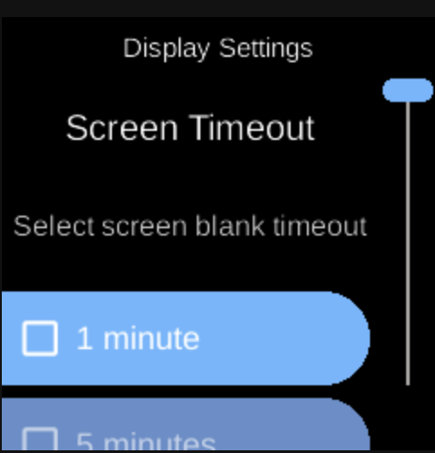

# Display

**Services**  
Display

*Image: Display service (placeholder).*

The **Display** service controls screen blanking, redraws, and activity-based blank timeout. The menu app subscribes to redraw events to update the framebuffer sent to the physical display or emulation.

## What you see

- **State** (`DisplayState`) — Paused/resumed, blanked, blank timeout (e.g. 1 min, 5 min, off), last activity.
- **Actions** — `DisplayPauseAction`, `DisplayResumeAction`, `DisplayRedrawAction`, `DisplayBlankAction`, `DisplayUnblankAction`, `DisplayUpdateActivityAction`, `DisplaySetBlankTimeoutAction`.
- **Events** — `DisplayRedrawEvent` — emitted when the UI should redraw; the menu app and web UI subscribe to it.
- **Implementation** — `ubo_app/services/000-display/`. Headless Kivy renders to a buffer; `ubo_app.display.render_on_display` sends it to the LCD (or emulation).

## Navigation

- [Architecture → Services](../architecture/services.md)
- [Architecture → Menu App](../architecture/menu-app.md)
- [Home → Settings → Display](../home/settings/display.md)
