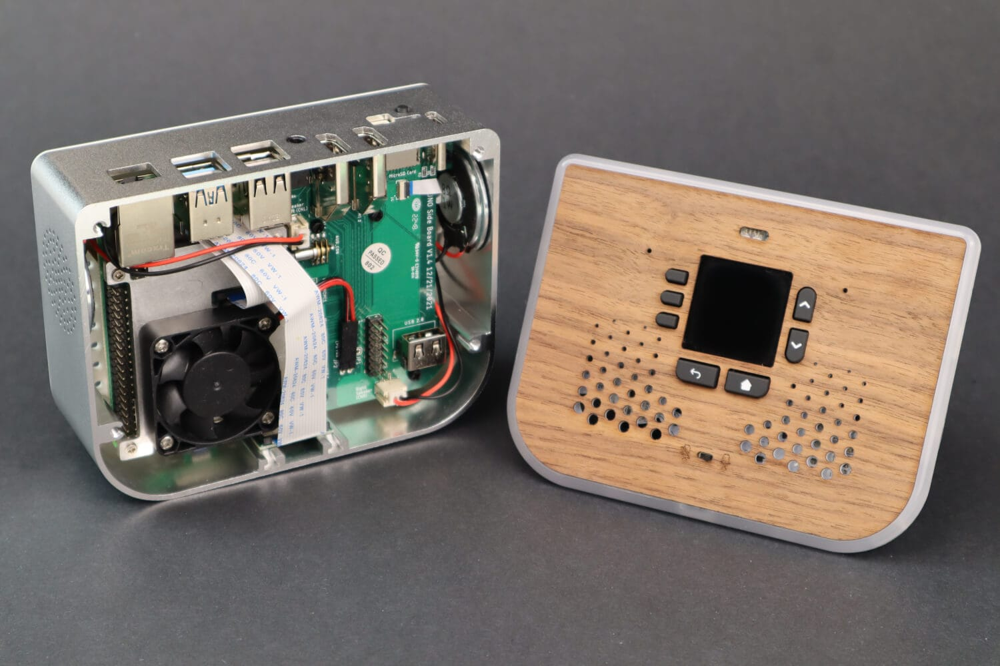

# File System

**Services**  
File System

*Image: File System (showing internal device structure).*

The **File System** service provides file operations from the UI: browse, select, copy, move, remove. State holds the current selection and optional paths; actions perform operations (often via system or async tasks).

## What you see

- **State** (`FileSystemState`) — Selection (e.g. selected path or file list), and any error/status.
- **Actions** — `FileSystemReportSelectionAction`, `FileSystemCopyAction`, `FileSystemMoveAction`, `FileSystemRemoveAction`.
- **Implementation** — `ubo_app/services/090-file-system/`: file_application, reducer, setup, ubo_handle; constants for paths. May integrate with system manager for privileged file ops.

## Navigation

- [Architecture → Services](../architecture/services.md)
- [Home → Settings → System](../home/settings/system.md)
