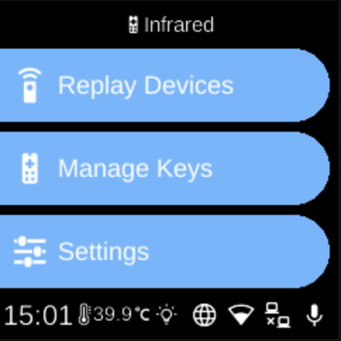

# Infrared

**Services**  
Infrared

*Image: Infrared remote (placeholder).*

The **Infrared** service handles IR receive and send: receive raw codes, send codes, register devices (e.g. remotes), and manage replay devices and key mappings. Used for remote control and automation.

## What you see

- **State** (`InfraredState`) — Should propagate, should receive; is registering; registration code; devices list; replay devices; etc.
- **Actions** — `InfraredHandleReceivedCodeAction`, `InfraredSendCodeAction`, `InfraredSetShouldPropagateAction`, `InfraredSetShouldReceiveAction`, `InfraredRegisterDeviceAction`, `InfraredSetIsRegisteringDeviceAction`, `InfraredSetRegistrationCodeAction`, `InfraredAddDeviceAction`, `InfraredRemoveDeviceAction`.
- **Events** — Emitted when codes are received or registration state changes.
- **Implementation** — `ubo_app/services/090-infrared/`: registration_page, reducer, setup, ubo_handle; system manager may handle ir-keytable or hardware commands.

## Navigation

- [Architecture → Services](../architecture/services.md)
- [Home → Settings → Infrared](../home/settings/infrared.md)
- [Home → Settings → Replay Devices](../home/settings/infrared-replay-devices.md)
- [Home → Settings → Manage Keys](../home/settings/infrared-manage-keys.md)
