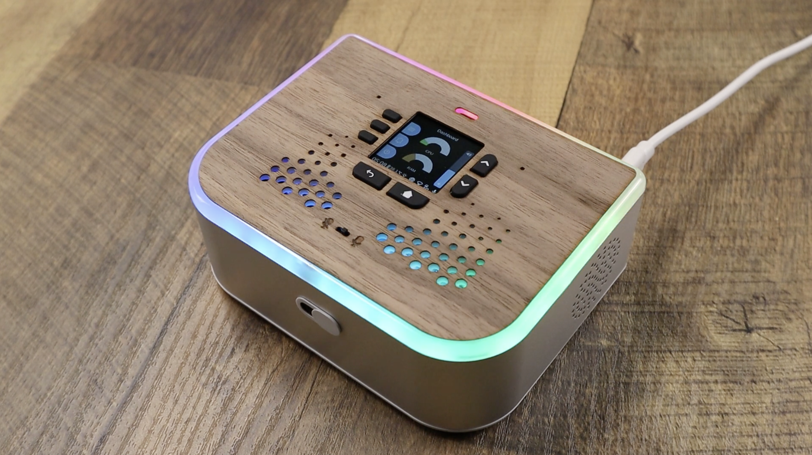

# RGB Ring

**Services**  
RGB Ring

*Image: RGB LED ring.*

The **RGB Ring** service drives the addressable LED ring (e.g. 27 LEDs on Ubo Pod). It supports solid colors, brightness, blank, rainbow, pulse, blink, progress wheel, spinning wheel, and sequences—used for status and feedback.

## What you see

- **State** (`RgbRingState`) — Enabled, busy, current pattern/color state.
- **Actions** — `RgbRingSetIsBusyAction`, `RgbRingSetEnabledAction`, `RgbRingSetAllAction`, `RgbRingSetBrightnessAction`, `RgbRingBlankAction`, `RgbRingRainbowAction`, `RgbRingPulseAction`, `RgbRingBlinkAction`, `RgbRingProgressWheelAction`, `RgbRingSpinningWheelAction`, `RgbRingFillUptoAction`, `RgbRingFillDownfromAction`, `RgbRingSequenceAction`, and waitable variants.
- **Implementation** — `ubo_app/services/040-rgb-ring/`: reducer, setup, ubo_handle; uses NeoPixel/WS281x-style drivers on RPi.

## Navigation

- [Architecture → Services](../architecture/services.md)
- [Home → Settings → Hardware](../home/settings/hardware.md)
