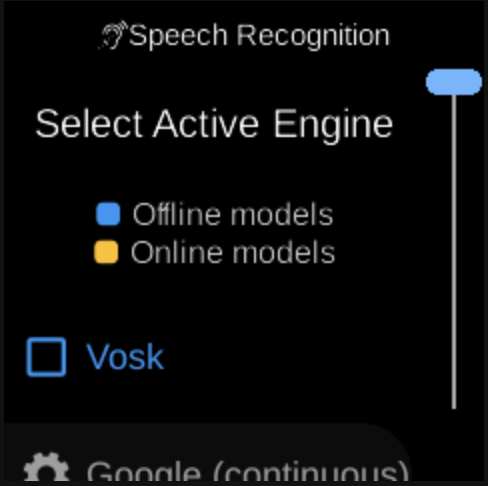

# Speech Recognition

**Services**  
Speech Recognition

*Image: Speech recognition / STT (placeholder).*

The **Speech Recognition** service handles speech-to-text: engine selection (e.g. Vosk, Google), wake word detection, intent detection, and raw speech results. Used by the assistant and accessibility.

## What you see

- **State** (`SpeechRecognitionState`) — Selected engine, engines list; is intents active; is assistant active; wake word and intent state.
- **Actions** — `SpeechRecognitionSetSelectedEngineAction`, `SpeechRecognitionSetIsIntentsActiveAction`, `SpeechRecognitionSetIsAssistantActiveAction`, `SpeechRecognitionReportWakeWordDetectionAction`, `SpeechRecognitionReportIntentDetectionAction`, `SpeechRecognitionReportSpeechAction`.
- **Events** — Emitted when speech or wake word is detected.
- **Implementation** — `ubo_app/services/090-speech-recognition/`: abstraction (base_class, speech_recognition_mixin, wake_word_recognition_mixin), engines_manager, google_engine, vosk_engine, reducer, setup, ubo_handle. Uses engines from `ubo_app/engines/`.

## Navigation

- [Architecture → Services](../architecture/services.md)
- [Architecture → Engines](../architecture/engines.md)
- [Home → Settings → Accessibility → Speech Recognition](../home/settings/accessibility-speech-recognition.md)
- [Home → Settings → Assistant → Speech Recognition](../home/settings/assistant-speech-recognition.md)
- [Services → Assistant](assistant.md)
