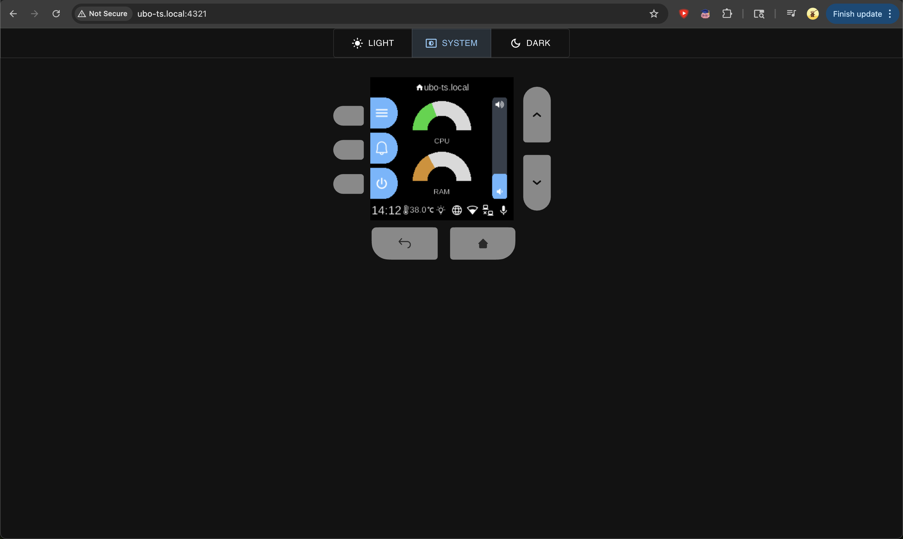

# Web UI

**Services**  
Web UI

*Image: Web UI.*

The **Web UI** service serves the browser-based interface (e.g. port 4321): dashboard, hotspot config, and real-time subscription to store state and display/audio events so the web client mirrors the device UI and playback.

## What you see

- **State** (`WebUIState`) — Configuration or status used by the web UI (e.g. theme, connection state).
- **Implementation** — `ubo_app/services/090-web-ui/`: reducer, setup, ubo_handle; `templates/index.jinja2`; `web-app/` is a TypeScript/React app (client, display store-event-handler, inputs, status). It subscribes to the store via gRPC or WebSocket and renders a mirror of the display and controls. Build with `npm run build` in `web-app/`; proto compile for types.

## Navigation

- [Architecture → Services](../architecture/services.md)
- [Architecture → RPC](../architecture/rpc.md)
- [Home → Settings → Network](../home/settings/network.md) — Hotspot
- [Ubo interface](../ubo-interface.md)
