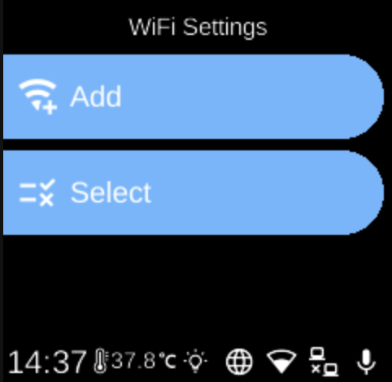

# Wi-Fi

**Services**  
Wi-Fi

*Image: Wi-Fi networks (placeholder).*

The **Wi-Fi** service manages wireless connections: scan, connect, disconnect, and onboarding (e.g. QR code or hotspot). It uses NetworkManager on Raspberry Pi and updates the store with connection state and visited-onboarding flag.

## What you see

- **State** (`WiFiState`) — Connection state (`ConnectionState`), list of networks, “has visited onboarding”, and related fields.
- **Actions** — `WiFiInputConnectionAction` (e.g. QR or credentials), `WiFiSetHasVisitedOnboardingAction`, `WiFiUpdateAction`, `WiFiUpdateRequestAction`.
- **Events** — Emitted when connection or scan state changes.
- **Implementation** — `ubo_app/services/030-wifi/`: `wifi_manager.py`, `pages/` (e.g. create connection UI), reducer, setup, ubo_handle. Camera may be used for QR-based WiFi onboarding.

## Navigation

- [Architecture → Services](../architecture/services.md)
- [Home → Settings → Wi-Fi](../home/settings/wifi.md)
- [Home → Settings → Network](../home/settings/network.md)
- [Services → Camera](camera.md) — QR for WiFi
