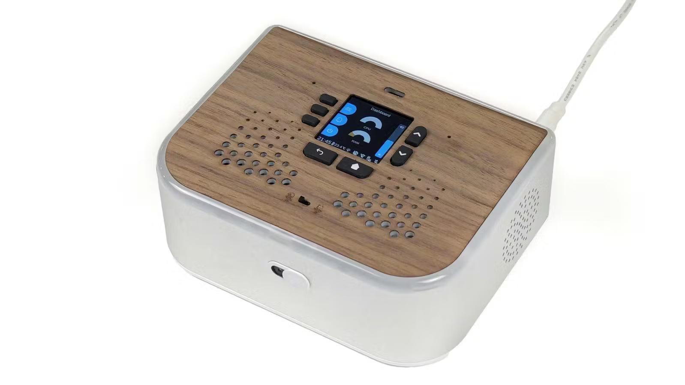

# Ubo interface

The Ubo device has a physical keypad with seven buttons. Here is what each one does.

## Navigation buttons

- **UP** (↑) — Move up in lists and menus. On the home screen, press to turn volume up.
- **DOWN** (↓) — Move down in lists and menus. On the home screen, press to turn volume down.
- **BACK** (⟲) — Go back one level or close the current screen.
- **HOME** (⌂) — Go to the home screen. **Press and hold** on the home screen to talk to the assistant (release when done).

## Selection buttons (L1, L2, L3)

Three buttons on the left (**L1**, **L2**, **L3**) select the first, second, or third item on the screen. In menus they choose the option shown next to each label.

## Combination shortcuts

These use two buttons at once:

- **HOME + L1** — Take a screenshot.
- **HOME + L2** — Save a store snapshot (for debugging).
- **HOME + L3** — Start or stop recording your key presses.
- **BACK + L3** — Replay the last recorded key sequence.
- **HOME + BACK** — Exit the application.
